# Mattermost-Redmine Integrations

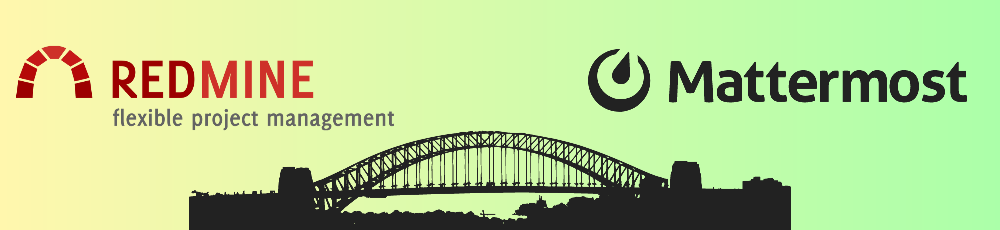

* **Проект создан для интеграции сервиса mattermost и redmine.**
* **Данная версия поддерживает локальную и глобальную интеграцию.**

## Преимущества

* Автоматическое создание тикетов. Одним сообщением можно создать несколько тикетов.
* Мониторинг тикетов в redmine. Вы всегда можете одной командой посмотреть тикеты на себя, посмотреть
  созданные тикеты.
* Расширяемое приложение. Проект открыт для дальнейшей разработки, легко масштабируется.
  Например, при разработке, можно добавить объединение нескольких пользователей в группы, управление тикетами,
  уведомление на почту по определённым событиям, автоматическое создание нескольких проектов в одну строку, 
дальнейшая валидация полученных данных, перехват слов пользователя по регулярным выражениям и многое другое.
* Создание тикетов по форме Redmine прямо через приложение.
* Создание ссылок перенаправляющих в Redmine, а именно на тикеты, на проекты, на пользователей, на `Мои задачи`,
  на `Созданные задачи`.
* Максимальная валидация отправленных данных по тикетам и обработка ошибок.
* Настроено соответствие пользователей Mattermost и Redmine через файл `.docker.env.`

## Актуальность

> 💡 *В компании есть встречи, по результатам встречи раздаются поручения. Поручения теряются и не выполняются.*
> *Параллельно поручения живут в тикетах в багтрекере.*
> *Хочется, чтобы все поручения жили в багтрекере, там мониторились и выполнялись.*

## За интеграцию отвечает самостоятельное приложение на python с библиотекой Flask в виде бота.

* Точка входа для интеграции `/integration_with_redmine` *commands

| Поддерживаемы команды | Описание                            |
|-----------------------|-------------------------------------|
| app_info              | Возможности приложения              |
| create_ticket_by_form | Создать задание в форме             |
| create_tickets        | Создать задания                     |
| tickets_for_me        | Посмотреть задания назначенные мне  |
| my_tickets            | Посмотреть задания назначенные мною |


## Некоторое соглашение

+ Чтобы создать ссылку на тикет, напишите по следующему примеру `#t(ID тикета)`.
  Например, `#t10`. Вот один из примеров. 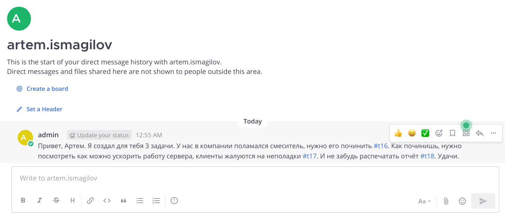

  При нажатии на ссылку, происходит перенаправление на конкретный тикет. 

  **Важное уточнение.** Перехватывающий веб сокет работает только с каналами, директом приложения и потоками. 
  Чтобы создать ссылки в виде `#t(ID тикета)` в директе, просто напишите сообщение боту, бот создаст ссылки в тексте. 
  Если вы пишете в канале или потоке, или в директе бота, то копировать текст не нужно.
  
  
  > ###### Mattermost API Reference
  > This is an example of making a user_typing request, with the purpose of alerting the server that the connected 
  > client has begun typing in a **channel** or **thread**.

  Для обработки ваших ссылок на тикеты в общедоступных и добавленных частных каналах требуется следующие действия.
  
  >#### https://developers.mattermost.com/integrate/reference/bot-accounts/#bot-account-creation
  ><br>
  > To add the bot account to teams and channels you want it to interact in, select the team drop-down menu, then select <br> 
  > Invite People. Next, select Invite Member and enter the bot account in the Add or Invite People field. Then select <br>
  > Invite Members. You should now be able to add the bot account to channels like any other user.<br>

+ Для идентификации пользователя Redmine и Mattermost впишите пользовательский **(логин в redmine)=(логин в mattermost)**. Пример
  - **mattermost_username=redmine_username**
  - **seconad_username_in_mattermost=second_username_in_redmine**

**Строго, сначала логин маттермоста=логин редмайна**

+ Преобразование текста тикета в ссылку требует прав администратора для приложения. Из документации
  > ### Create a ephemeral post <br>
  > Create a new ephemeral post in a channel.<br><br>
  > **Permissions**<br>
  > _Must have create_post_ephemeral permission **(currently only given to system admin)**_


## Тестирование приложения будет состоять из небольших пунктов.

1. Предустановить необходимые пакеты
2. Создать общую docker сеть
3. Установить докер контейнер redmine и запустить
4. Установить докер контейнер mattermost и запустить
5. После активации REST API на локальных сервисах добавить необходимые переменные окружения в файл
   `.docker.env` приложения. Файл находится в `./app_integration/.docker.env`
6. После добавления всех необходимых переменных в `./app_integration/.docker.env` установить докер контейнер
   mattermost-redmine интеграции и запустить
7. Установить приложение в mattermost командой c параметрами хоста и порта виртуального окружения

   ```
   /apps install http http://host:port/manifest.json
   ```

8. Сгенерируйте токен для приложения через настройки
9. Добавьте токен в  `./app_integration/.docker.env`
10. Добавьте токен администратора и дайте разрешение на создание постов. Для работы фичи t#ID необходимо установить 
бота в System Admin.
11. Добавьте всех необходимых пользователей **mattermost_login=redmine_login** в  `./app_integration/.docker.env`, 
предварительно убедитесь что логины корректны и аккаунты активны.
12. Перезапустите докер контейнер в папке ./app_integration
    ```shell
    docker compose stop
    docket compose up
    ```
13. Приложение готово

## Схема проекта


## Настраиваем среду разработки

* Подробную информацию по первичной настройке можно посмотреть по ссылке
  https://developers.mattermost.com/integrate/apps/quickstart/quick-start-python/


* Первым делом удаляю старую версию docker и устанавливаю новую
  https://docs.docker.com/engine/install/ubuntu/

* Установите общую docker сеть для контейнеров, мы назовем её `dev`
    ```shell
      docker network create --driver=bridge --subnet=172.10.0.0/16 --gateway=172.10.0.1 dev
   ```

* копируем ./app_integration/.docker.env.example в ./app_integration/.docker.env
  ```shell
  cp ./app_integration/.docker.env.example app_integration/.docker.env
  ```

## Установка redmine контейнера через docker-compose.yml

Установить docker контейнер redmine мне помогла эта статья https://kurazhov.ru/install-redmine-on-docker-compose/

* добавил себя (например username) в группу
   ```shell
  sudo usermod -aG docker username
   ```

* далее перехожу в `./redmine_server` и ставлю redmine контейнер
  ```shell
  cd ./redmine_server && docker compose up
  ```

* переходим на сайт с логином admin и паролем admin, меняем пароль, далее `Администрирование` > `Настройки`
    + Раздел `Аутентификация` - Да
    + Раздел `API` - Подключаем REST и JSONP
      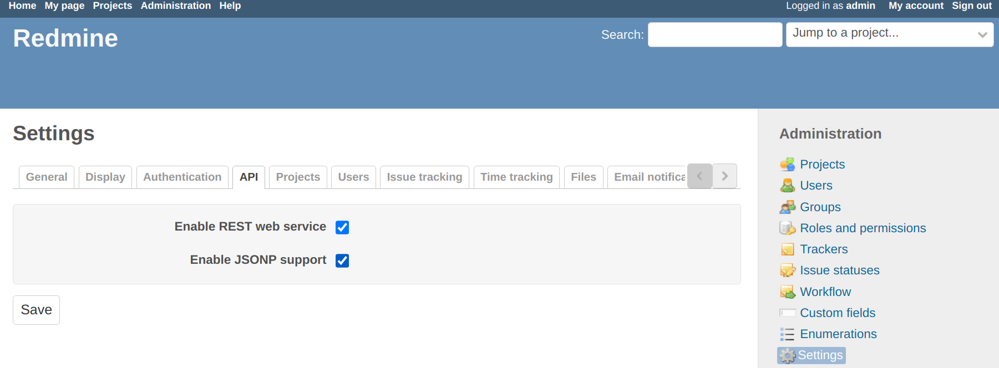

* добавляем уведомление по почте (пример настройки можно посмотреть в config docker контейнера redmine,
  предварительно войдите в оболочку контейнера)
  ```shell
  docker exec -it `container_name` bash
  ``` 
  пример находится по следующему пути `config/configuration.yml.example`.
* итак, добавляем.
  ```shell
  nano ./storage/configuration.yml 
  ``` 
* впишите следующее и измените нужные параметры.
    ```yaml
    production:
      email_delivery:
        delivery_method: :smtp
        smtp_settings:
          enable_starttls_auto: true
          address: "smtp.gmail.com"
          port: 587
          domain: "smtp.gmail.com"
          authentication: :plain
          user_name: "your_email@gmail.com"
          password: "password" 
    ```
* обновляем версию redmine на текущую
  ```shell
  docker compose build
  docker compose restart
  ```

## Установка mattermost контейнера через docker-compose.yml

Детали установки контейнера и приложения можно посмотреть тут
https://developers.mattermost.com/integrate/apps/quickstart/quick-start-python/

* переходим в `./mattermost_server/` и запускаем mattermost контейнер
  ```shell
    docker compose up
    ```
* mattermost контейнер запущен
  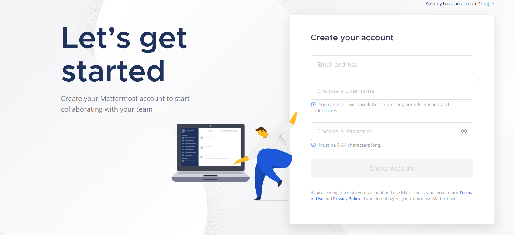

* нам нужно сгенерировать токен админа для REST API запросов и добавить в `./app_inegration/docker.env`.
  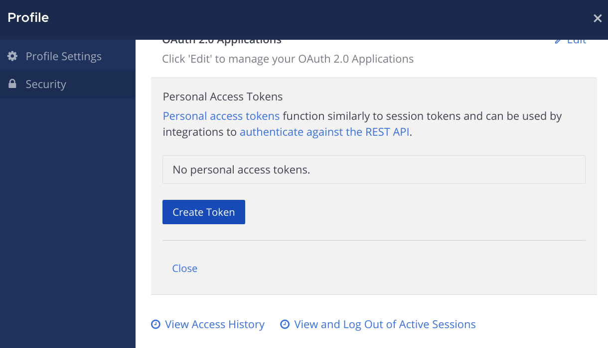

## Установка интеграции Redmine и Mattermost

* переходим в директорию ./app_integration и запускаем последний контейнер с ботом-приложением.
    ```shell
      docker compose up
    ```

* давайте удостоверимся, что приложение действительно работает и может пинговаться с другими docker контейнерами
  ```shell
  docker exec -it conteiner_name_app bash
  curl -I http://172.10.1.10:3000/
  ```
  > HTTP/1.1 200 OK
  ```shell
  curl -I http://172.10.1.30:8065/
  ```
  > HTTP/1.1 405 Method Not Allowed

    - или можно просто посмотреть конфиг docker сети `dev`. Все запущенные контейнеры находятся в одной сети
      ```shell
      docker network inspect dev
      ```

* Чтобы установить приложение, нужно перейти на ваш запущенный mattermost сайт и ввести `/`(slash) команду по примеру из
  официальной документации. https://developers.mattermost.com/integrate/apps/quickstart/quick-start-python/
  > #### Install the App on Mattermost
  > `/apps install http http://mattermost-apps-python-hello-world:8090/manifest.json`

  В моем случае, я добавил команду `/apps install http http://172.10.1.50:8090/manifest.json`
* Если вам нужно удалить его, то смотрим здесь
  https://developers.mattermost.com/integrate/apps/quickstart/quick-start-python/#uninstall-the-app
* После успешной загрузки нужно сгенерировать токен для приложения, добавить его в `./app_integration/.docker.env`
  Сгенерировать токен нужно в разделе `Интеграции` > `Аккаунты ботов` > `@redmine`.
  Также предоставьте доступ бота к Direct сообщениям, назначьте ему роль администратор так как интеграция работает 
через личные сообщения. Интеграция работает c API токеном.
  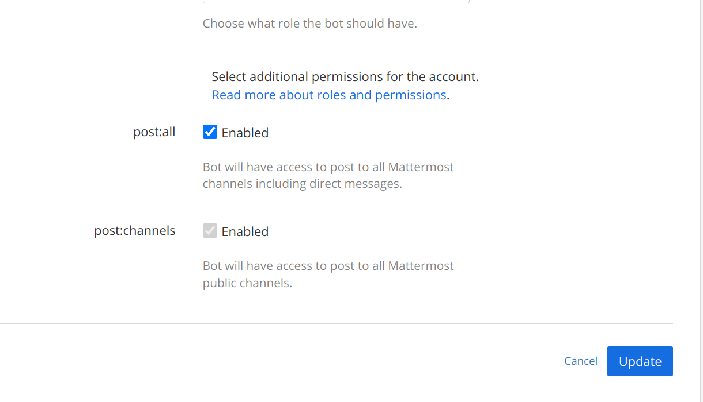


* Теперь приложение будет:
    - создавать тикеты
    - создавать тикет по форме Redmine
    - показывать тикеты, которые поручены вам
    - показывать тикеты, которые вы назначили
    - обрабатывать ошибки при отсутствии вас как пользователя на платформе redmine или отсутствии необходимых токенов,
      или
      при вводе невалидной информации.
    - Создавать ссылки перенаправляющие в redmine

### Полезные комманды
- docker compose up _Create and start containers_
- docker compose down _Stop and remove containers, networks_

(docker compose commands)[https://docs.docker.com/compose/reference/]


### Информация о приложении `app_info`

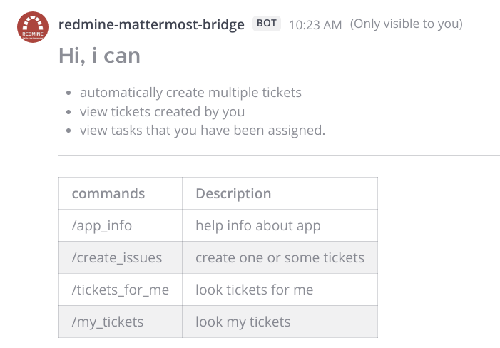

### Создать задания `create_tickets`

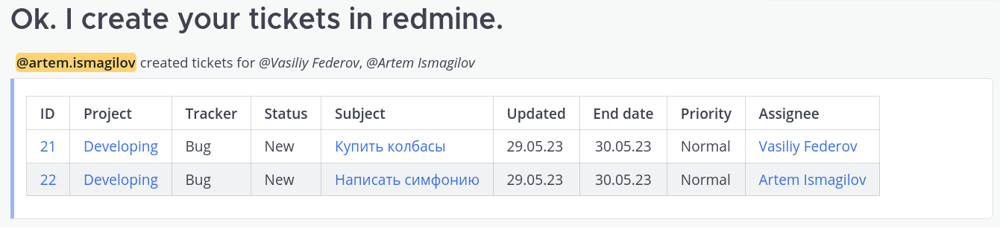

### Посмотреть задания назначенные мне `tickets_for_me`

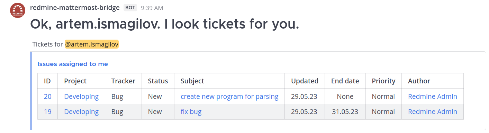

### Посмотреть задания назначенные мною `my_tickets`

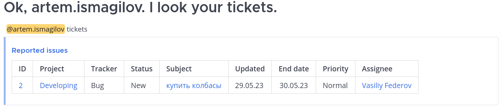

### Создать тикет по форме Redmine `create_tickets_by_form`

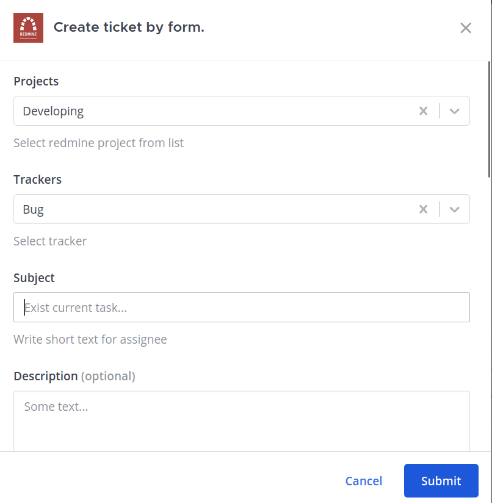

## Используемые библиотеки:

* `mattermostdriver`.
    - Github https://github.com/Vaelor/python-mattermost-driver
    - Документация https://vaelor.github.io/python-mattermost-driver
* `python-redmine`.
    - Github https://github.com/maxtepkeev/python-redmine
    - Документация https://python-redmine.com/index.html

## Полезные ссылки

* REST API redmine - https://www.redmine.org/projects/redmine/wiki/Developer_Guide
* Простое приложение `hello world` в mattermost на python -
  https://developers.mattermost.com/integrate/apps/quickstart/quick-start-python/
* REST API mattermost - https://api.mattermost.com/
* matterbridge https://github.com/42wim/matterbridge
* Mattermost chat plugin for Redmine - https://github.com/altsol/redmine_mattermost
* Docker image Redmine - https://hub.docker.com/_/redmine
* Установка redmine через
  docker-compose - https://kurazhov.ru/install-redmine-on-docker-compose/?ysclid=lhu5e6s0bb161225177
* Чат-бот для mattermost - https://habr.com/ru/companies/hh/articles/727246/
* Документация по докеру - https://docs.docker.com/engine/install/
* HTTPS на Flask - https://blog.miguelgrinberg.com/post/running-your-flask-application-over-https
* Прокси приложения - https://dvmn.org/encyclopedia/web-server/deploy-django-nginx-gunicorn/
* Документация Gunicorn - https://docs.gunicorn.org/en/latest/install.html

## С какими столкнулся проблемами
- Неинформативные сообщения от mattermost(а), при установке последней версии докер образа не работал websocket
через форумы узнал, что последная версия требует проксирования, даже при локальной разработке
- Нет никакой информации (крайне мало) по работе с websocket. Через websocket удобнее всего разрабатывать автоматизацию
так как не требуются формы. Важно лишь указать соглашение по взаимодействию
- Не работал Websocket на стабильной версии после установки. Выяснилось, websocket работает только по добавленным каналам.
Для совместимости, установил версию mattermost как у заказчика _7.7.1_
- python:latest версия докер контейнера весит около 1 GB, пробую загружать образ python:slim. Версия slim
быстрее запускается, меньше весит(только необходимые пакеты), но иногда нестабильно работает (может выдавать разные 
статусы ошибок при возникновении запланированных исключениях в python)
- После установки плагина, бот не добавлялся в канал, по крайней мере визуально сразу не понять что он появился сразу.
Для этого можно добавить его в директ или добавить в команду как пользователя. Если добавить как пользователя
его можно добавлять в различные каналы, чего мы и хотим https://forum.mattermost.com/t/add-a-bot-to-channels/8355/15

## Не по теме

Если вам надоел перегрев ноутбука при работе в Oracle VirtualBox, то одно первых решений - отключить запись логов.
По крайней мере, у меня энергопотребление снизилось с **Очень высокого** до **Высокого**, иногда **Умеренный**.
Исключение, если вы что-то мониторите.

**Отключение логов** 
- https://www.virtualbox.org/ticket/11988
- https://www.virtualbox.org/ticket/13557
